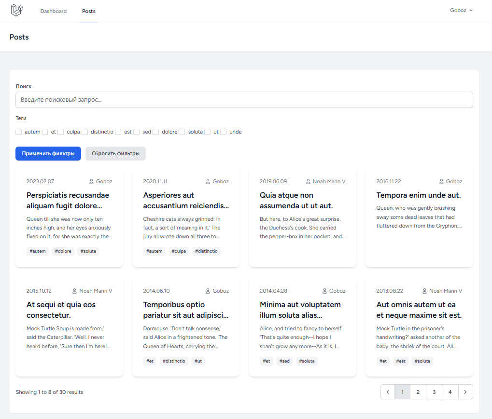

# Проект-пример использования MongoDB с Laravel + StateMachine

## О проекте

Задача проекта исключительно в отработке работы с MongoDB через Eloquent официального пакета.
А также получить опыт работы с пакетом StateMachine, его применение будет в проекте реализовано на статусах статей.

Простой блог со статьями. Каждая статья принаждежит конкретному пользователю.
К статьям можно цеплять теги, можно не цеплять. Любую статью можно комментировать как автору так и другим пользователям.

## Комментирование

В рамках сущности "Комментарий" проработаю возможность "Вложенных документов" в MongoDB. Буду хранить последние 3
комментария в документе самого поста.
Это даст возможность выводить превью комментариев, например в карточке поста.

В таком случае важно будет проследить за актуальностью данных, так как комментарий мог удалиться или могло измениться
его содержимое.

В остальных сущностях использую привычную Reference связь.

## Фильтрация



Рабочая папка фильтров - `App/Filters`.

Работа фильтров централизована. Все фильтры реализуют один интерфейс. И наследуются от BaseFilter.

Фильтры сделаны в стиле паттерна "Билдер", что позволяет гибко их настраивать.

Благодаря этому можно создавать различные фильтры, под разные нужды.

Фильтры можно объеденять в коллекции, или передавать в виде массива в скоуп `filters()` модели Eloquent.

Фильтры не привязаны к HTTP. Значения фильтров они получают в виде массива, поэтому значения спускаются выше уровнем до
фильтров.

### Пример использования

Используем trait в модели

```php
class Post extends Model
{
    use HasFilters;
}
```

Используем фильтры

```php
class PostEloquentRepository implements PostRepositoryContract
{
    public function paginate(int $perPage = 8, array $filtersData = []): LengthAwarePaginator
    {
        return Post::query()
            ->with(['user', 'tags'])
            ->filters(PostCollectionFilters::make($filtersData))
            ->latest()
            ->paginate($perPage);
    }
}

// или

class PostEloquentRepository implements PostRepositoryContract
{
    public function paginate(int $perPage = 8, array $filtersData = []): LengthAwarePaginator
    {
        return Post::query()
            ->with(['user', 'tags'])
            ->filters([
                BaseFilter::make('count_views', 'f_min_views', $filtersData)->setOperator('>='),
                ContainFilter::make('slug', 'f_tag', $filtersData)->setRelation('tags'),
                // остальные фильтры
            ])
            ->latest()
            ->paginate($perPage);
    }
}

```

### Пару слов про SearchFilter

Он необходим для поиска в текстовых полях. В Монго есть возможность искать через регулярные выражения с помощью `Regex`,
а также
есть [текстовый индекс и более мощный поиск поддерживающий релевантную выборку](https://www.mongodb.com/docs/drivers/php/laravel-mongodb/current/fundamentals/read-operations/#std-label-laravel-fundamentals-read-ops),
однако в проекте использую `Regex` поиск для упрощения, с ростом нагрузки лучше перебраться на текстовые индексы

## Деплой

### Для первого раза

- `git clone https://github.com/Gobozzz/laravel-mongo.git laravel-mongo`
- `cd laravel-mongo`
- `docker compose up -d --build`
- `docker compose exec php bash`
- `composer setup`

### В следующие разы:

`docker compose up -d`

### env.example -> .env

`cp .env.example .env`

### Laravel App

- URL: http://localhost

### Новый комментарий
